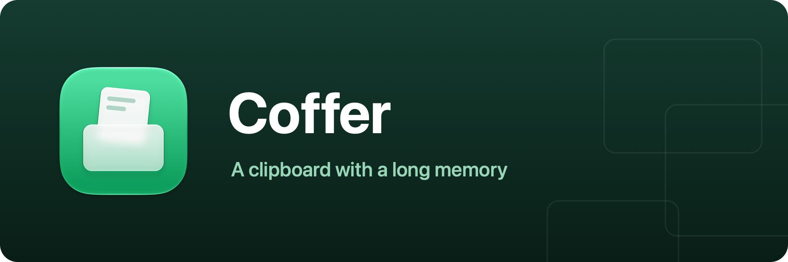

<p align="center">
  
</p>

<p align="center">
  A macOS menu bar clipboard manager — everything you copy, kept safe, searchable, and one shortcut away.<br />
  A single dependency-free Swift Package — builds with the <code>swift</code> CLI alone, no Xcode project required.
</p>

## What it does

- Watches the pasteboard and keeps a history of everything you copy (skipping entries that
  password managers mark as concealed).
- Press <kbd>⌘⌥C</kbd> anywhere to summon the history panel — <kbd>↑</kbd>/<kbd>↓</kbd> to pick
  an entry, <kbd>↩</kbd> (or double-click) to copy it back to the clipboard,
  <kbd>Esc</kbd> to dismiss.
- Keeps the history newest-first, promotes re-copied items instead of duplicating them, and
  caps the stored count — a pure model in `ClipboardHistory.swift`, tests and all.

## Building the app

```sh
./Scripts/bundle.sh
open build/Coffer.app
```

The app icon is compiled from the Icon Composer document at `Assets/AppIcon.icon` (generated by
`swift Scripts/make-assets.swift`), so on macOS 26+ the system renders it live with the Liquid
Glass treatment — including the dark, clear, and tinted variants.

## Development

```sh
swift run             # run once
./Scripts/dev.sh      # rebuild & relaunch on source changes
./Scripts/test.sh     # unit tests (equivalent to `swift test`)
```

Swift Testing needs full Xcode — Command Line Tools alone won't run it.

## Code structure

```
Sources/Coffer/
├── main.swift                   # Entry point (accessory app, no Dock icon)
├── AppDelegate.swift            # Menu bar item, hotkey + watcher wiring
├── ClipboardHistory.swift       # Pure history model: ordering, promotion, cap (tested)
├── ClipboardStore.swift         # App-side store around the model, change notifications
├── PasteboardWatcher.swift      # changeCount polling, concealed-type filtering
├── HotKeyCenter.swift           # Carbon RegisterEventHotKey wrapper (⌘⌥C)
└── HistoryPanelController.swift # The floating history palette
```

## Roadmap

- **Search** — type in the panel to filter the history.
- **Persistence** — survive relaunches; app exclusions.
- **Settings** — launch at login, history size, a recordable shortcut (the System
  Settings–style sidebar window the sibling apps use).
